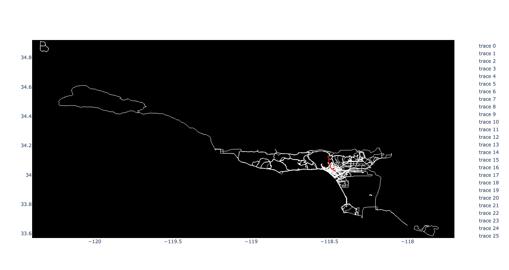

# What does this package do

This codebase parses gpx and fit files downloaded from Strava, a popular fitness tracker for outdoor sports. The data can be thrown on a plot, or into a graph data structure. Once you have a graph, you can calculate the best route between two points, with preference for routes that are taken more frequently.

Here is an example of a plot with a ropute generated in red:



Currently, this package does not support interfacing with Strava's API. For now I reccomend using [strava docs on bulk exporting.](https://support.strava.com/hc/en-us/articles/216918437-Exporting-your-Data-and-Bulk-Export)


See the [guide](/docs/guide.md) for more details on how to use the package.
# Installing and Developing
## Build

Make sure `build` package is installed, then build package:

```
python3 -m build
```

and install:

```
python3 -m pip install ./dist/strava_map*tar.gz
```

## Running tests

To run tests:

```
pytest .
```

## Reccomended Devtools

Formatting:
```
ruff format
```

Linting and fixing things in place:
```
ruff check --fix
```

Static type checking:
```
mypy src
```

and

```
mypy tests
```

# TODO: 

- Hook into strava, garmin, wahoo, etc API's to automate data downloads.
- Setup CI to run mypy, pytest, and ruff.
- Package as CLI app.
- Add logging.
- Update to python 3.12.
- Build docs with sphinx.
- Add support for more data to `Activity` class (power, heart rate), and use to filter plots and support more interesting fitness related analysis.
- Web front end so you can click on plot to add points and generate routes.